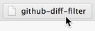
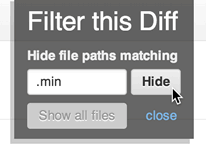
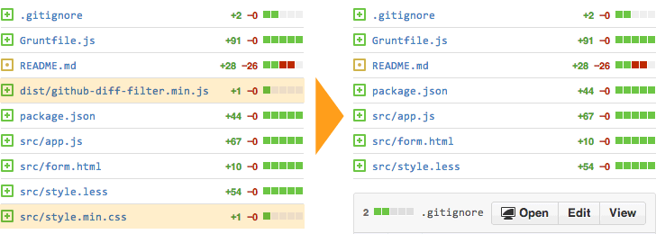

# github-diff-filter

A bookmarklet to allow you to filter the list of files in GitHub's comparison views.

When viewing a commit or pull request with a large number of modified files or lines,
it might be helpful to have the ability to filter that list of files on the fly so that you can:
- review smaller chunks of it at one time
- ignore things that need no review or can't practically be reviewed (e.g., minified files)

## Getting Started

1. Open up
   [`dist/github-diff-filter.min.js`](https://github.com/Scotchester/github-diff-filter/blob/master/dist/github-diff-filter.min.js).
2. Copy the entirety of its contents.
3. Create a new bookmark in your browser and paste what you copied
   (and _only_ what you copied) into the URL field.
4. Visit a GitHub comparison page (e.g., the **Files Changed** tab on a Pull Request)
   and click the bookmarklet you just created.

   
5. Enter a query into the field and press `Return` or click the **Hide** button.

   
6. Behold the magical disappearing files!

   

---

## Release History

### v1.1.0 - July 10, 2014

- Adds button to unhide all previously-hidden files.
- Adds ability to enter multiple comma-separated arguments into the text field.

### v1.0.1 - July 9, 2014

- Design improvements.
- Now tested on Safari 6, Internet Explorer 9.

### v1.0.0 – April 1, 2014

First release! Allows for simple hiding of files matching your query.
Tested on Google Chrome 31+.

## Roadmap

Some general, not-set-in-stone ideas for feature buildout order.
It is unclear at what point we'll run into the character limit for a bookmark URL,
at which point it will become much more difficult to add new features.

### v1.2

- Add to a list of activated filters each time the form is submitted.
- Allow for selective deactivation of single filters.

### v1.3

- Add a second form: **Show only files matching this query**
  (e.g., show me only `.css` files)

_Some UX work needed to figure out how best to handle this.
Would it override hiding filters already set?
Is it actually a second bookmarklet?_

### v1.4

- Detect filetypes present and offer checkboxes to show/hide them.

### v1.5

- Insert checkboxes next to each file in the Diff Stats list for one-click hiding of that file.
- Make the file diffs themselves collapsible on demand.
  - Proof of concept courtesy of @himedlooff: <https://gist.github.com/himedlooff/9673813>

## Getting involved

We welcome your feedback and contributions.
Filing issues and submitting pull requests is the best way to help out.
If you want to contribute code, pick an item off the roadmap above and do it!
It doesn't have to go in the proposed order.
If something farther down the list speaks to you more, implement it!

- [Find out about contributing](CONTRIBUTING.md)
- [File a bug](https://github.com/cfpb/github-diff-filter/issues/new?body=%23%23%20URL%0D%0D%0D%23%23%20Actual%20Behavior%0D%0D%0D%23%23%20Expected%20Behavior%0D%0D%0D%23%23%20Steps%20to%20Reproduce%0D%0D%0D%23%23%20Screenshot&labels=bug)

---

## Open source licensing info

1. [TERMS](TERMS.md)
2. [LICENSE](LICENSE)
3. [CFPB Source Code Policy](https://github.com/cfpb/source-code-policy/)

## Chrome Extension in development

@himedloof is working on some similar ideas in the form of a Chrome extension.
Link forthcoming.
