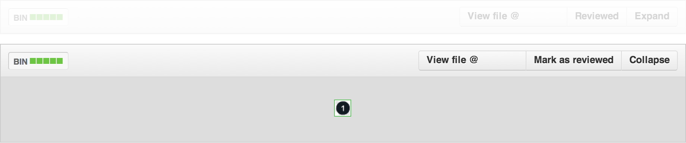

github-diff-filter
==================

When viewing a commit or pull request with a large number of modified files or lines,
it might be helpful to have the ability to filter that list of files on the fly so that you can:
- review smaller chunks of it at one time
- ignore things that need no review or can't practically be reviewed (e.g., minified files)


## Proof of concept

These lines can be run in the browser console to hide all files whose names contain the string `.min`:

```js
// Remove from Diff Stats list:
$('a[href^="#diff"]:contains(".min")').parent().hide();

// Remove the actual file diffs:
$('[data-path*=".min"]').parent().hide();
```


## Proof of concept Chrome extension



### Installing the extension

1. Clone this repo and `cd` into its root
2. `mv manifest-sample.json manifest.json` - Renames `manifest-sample.json`.
3. In `manifest.json` update the `matches` values under `content_scripts`.
If you have a private instance of Github Enterprise you'll want to edit
`manifest.json` and update the `matches` values under `content_scripts` to
point to your GHE domain.
Currently the extension targets comparison and pull request pages.
More on tweaking the matching patterns can be found
[here](http://developer.chrome.com/extensions/content_scripts#match-patterns-globs).
4. Follow these [instructions](http://developer.chrome.com/extensions/getstarted#unpacked)
for loading this repository as an unpacked extension.

### Contributing

#### Requirements

- [npm](https://npmjs.org/)
- [bower](http://bower.io/#installing-bower)
- [grunt-cli](http://gruntjs.com/getting-started)
- That's it! NPM will help you install everything else you need.

#### Workflow

1. Clone this repo and `cd` into its root
2. `npm install` - Initializes Grunt in this folder and installs dependencies.
3. `bower install` - Downloads third party libraries used in this extension.
4. `grunt bower` - Moves the files we need from `bower_components` to `vendor`.

## Roadmap

Some general, not-set-in-stone ideas for feature buildout order.

### v1.0

- Bookmarklet that pops up a small form over the page.
- Form has one text field and a submit button.
- On submit, the two commands described above in the **proof of concept** are run,
  using whatever is in the text field as the arguments to the
  `contains` function and `data-path` attribute selector.
  (I.e., replacing `.min` in the examples given.)
- Pop up stays open to allow for subsequent commands to be input; has close button to dismiss.

### v1.1

- Add button to unhide all previously-hidden files.
- Add ability to enter multiple comma-separated arguments into the text field.

### v1.2

- Add to a list of activated filters each time the form is submitted.
- Allow for selective deactivation of single filters.

### v1.3

- Add a second form: **Show only files matching this query**
  (e.g., show me only `.css` files)

_Some UX work needed to figure out how best to handle this.
Would it override hiding filters already set?
Is it actually a second bookmarklet?_

### v1.4

- Detect filetypes present and offer checkboxes to show/hide them.

### v1.5

- Insert checkboxes next to each file in the Diff Stats list for one-click hiding of that file.
- Make the file diffs themselves collapsible on demand.
  - Proof of concept courtesy of @himedlooff: <https://gist.github.com/himedlooff/9673813>


## Potential Chrome extension

This would deserve its own repo, but I wanted to mention that it might be cool to implement
as a Chrome extension, as well, that could load automatically when visiting a diff page.
